# Faraday command line 
Use faraday directly from your favorite terminal


## Install from source
```shell script
git clone git@gitlab.com:faradaysec/faraday-cli.git
cd faraday-cli
pip install .
```

### Adding Autocomplete to our shell
Zsh
```
echo ". $(pwd)/faraday-cli-autocomplete_zsh.sh" >> $HOME/.zshrc
```
Bash
```
echo ". $(pwd)/faraday-cli-autocomplete_bash.sh" >> $HOME/.bashrc
```

## Install from pip

```
TBA
```

## Commands

### Login

Configure login for farday-cli

```shell script
$ faraday-cli login
```


### View faraday-cli status

```shell script
$ faraday-cli status
Faraday Cli - Status

faraday_url            session                                                ssl_verify
---------------------  -----------------------------------------------------  ------------
http://localhost:5985  XXXXXXXXX                                              False


workspace
-----------
demo
```

### Select default workspace

```shell script
$ faraday-cli workspace -a select -n WORKSPACE_NAME
```

### Import vulns from tool report

```shell script
$ faraday-cli report "/path/to/report.xml"
```

### Import vulns from command

```shell script
$ faraday-cli command "ping -c 1 www.google.com"
```

### List workspaces

```shell script
$ faraday-cli workspace
```


### Create a workspace

```shell script
$ faraday-cli workspace -a create -n WORKSPACE_NAME
```

### Delete a workspace

```shell script
$ faraday-cli workspace -a delete -n WORKSPACE_NAME
```

### List hosts of a workspace

```shell script
$ faraday-cli host
```


### Get host

```shell script
$ faraday-cli host -a get -hid HOST_ID
```


### Create hosts

```shell script
$ faraday-cli host -a create -d '[{"ip": "stan.local", "description": "some server"}]'
```
or pipe it
```shell script
$ echo '[{"ip": "stan.local", "description": "some server"}]' | faraday-cli host -a create --stdin 
```


### Delete host

```shell script
$ faraday-cli host -a delete -hid HOST_ID
```

### List agents

```shell script
$ faraday-cli agent
```

### Get agent

```shell script
$ faraday-cli agent -a get -aid 1
```

### Run executor

```shell script
$ faraday-cli agent -a run -aid 1 -eid 1 -p '{"port_list": "1-9000", "target": "192.168.66.1"}'
```

