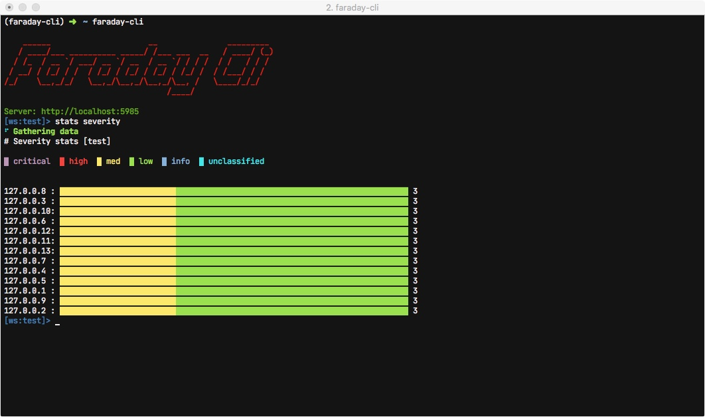

# Commands

## Authentication

### auth

Authenticate with your faraday server.

```
$ faraday-cli auth
Faraday url [http://localhost:5985]: http://localhost:5985
User: faraday
Password:
Saving config
✔ Authenticated with faraday: http://localhost:5985
```
*Optional rguments:*

| Syntax      | Description |
|:-----	|------:	|
| `-f/--faraday-url FARADAY_URL`       | url of your faraday server      |
| `-i/--ignore-ssl`   | Ignore SSL certificate validation        |
| `-i/--ignore-ssl`   | Ignore SSL certificate validation        |
| `-u/--user USER`  | Faraday user       |
| `-p/--password PASSWORD`  | Faraday password       |

!!! info "Faraday token expiration"
    You may want to change the faraday token expiration time, so you don't have to authenticate so often.

    The default is 12 hours.

    To do it change de value of ```api_token_expiration```(expressed in seconds) in your faraday ````server.ini````


### status

Show the status of your current authentication.

```
$ faraday-cli status
FARADAY SERVER         IGNORE SSL    VERSION         VALID TOKEN    WORKSPACE
---------------------  ------------  --------------  -------------  -----------
http://localhost:5985  False         community-3.14  ✔              test
```

## Workspaces

### list_ws

List workspaces created in faraday.

```
$ faraday-cli list_ws -p
+--------+---------+------------+---------+----------+----------+------------+
| NAME   |   HOSTS |   SERVICES | VULNS   | ACTIVE   | PUBLIC   | READONLY   |
|--------+---------+------------+---------+----------+----------+------------|
| test   |      13 |         13 | 39      | True     | False    | False      |
+--------+---------+------------+---------+----------+----------+------------+
```

*Optional Arguments:*

| Syntax      | Description |
|:-----	|------:	|
| `-j/--json-output`     | Show output in json     |
| `-p/--pretty`   | Show table in a pretty format       |
| `--show-inactive`   | Include inactive workspaces      |


### delete_ws

Delete workspace from faraday.

```
$ faraday-cli delete_ws test1
Deleting workspace: test1
Deleted workspace: test1
```

*Required Arguments:*

| Syntax      | Description |
|:-----	|------:	|
| `WORKSPACE_NAME`     | Workspace name     |

### get_ws

Get details of a workspace.

```
$ faraday-cli get_ws -p
+--------+----------+----------+------------+---------+------------+---------+
| NAME   | ACTIVE   | PUBLIC   | READONLY   |   HOSTS |   SERVICES |   VULNS |
|--------+----------+----------+------------+---------+------------+---------|
| test   | True     | False    | False      |      13 |         13 |      39 |
+--------+----------+----------+------------+---------+------------+---------+
```

*Optional Arguments:*

| Syntax      | Description |
|:-----	|------:	|
| `-w WORKSPACE_NAME`      | Workspace name     |
| `-j/--json-output`      | Show output in json     |
| `-p/--pretty`   | Show table in a pretty format       |

### select_ws

Select your active workspace, unless you use the ```-w``` argument all the commands will use this workspace.


```
$ faraday-cli select_ws test
✔ Selected workspace: test
```

*Required Arguments:*

| Syntax      | Description |
|:-----	|------:	|
| `WORKSPACE_NAME`      | Workspace name     |

### create_ws

Create a new workspace in faraday.


```
$ faraday-cli create_ws test_workspace
✔ Created workspace: test_workspace
```

*Required Arguments:*

| Syntax      | Description |
|:-----	|------:	|
| `WORKSPACE_NAME`      | Workspace name     |

*Optional Arguments:*

| Syntax      | Description |
|:-----	|------:	|
| `-d/--dont-select`      | Dont select after create     |

## Hosts

### list_hosts

List hosts in a workspace.


```
$ faraday-cli list_hosts -p
+------+------------+---------+-------------+------------+---------+
|   ID | IP         | OS      | HOSTNAMES   |   SERVICES |   VULNS |
|------+------------+---------+-------------+------------+---------|
|   11 | 127.0.0.1  | unknown |             |          1 |       3 |
|    3 | 127.0.0.10 | unknown |             |          1 |       3 |
|    6 | 127.0.0.11 | unknown |             |          1 |       3 |
|    5 | 127.0.0.12 | unknown |             |          1 |       3 |
|    7 | 127.0.0.13 | unknown |             |          1 |       3 |
|   13 | 127.0.0.2  | unknown |             |          1 |       3 |
|    2 | 127.0.0.3  | unknown |             |          1 |       3 |
|    9 | 127.0.0.4  | unknown |             |          1 |       3 |
|   10 | 127.0.0.5  | unknown |             |          1 |       3 |
|    4 | 127.0.0.6  | unknown |             |          1 |       3 |
|    8 | 127.0.0.7  | unknown |             |          1 |       3 |
|    1 | 127.0.0.8  | unknown |             |          1 |       3 |
|   12 | 127.0.0.9  | unknown |             |          1 |       3 |
+------+------------+---------+-------------+------------+---------+
```

*Optional Arguments:*

| Syntax      | Description |
|:-----	|------:	|
| `-w WORKSPACE_NAME`     | Workspace name    |
| `-p/--pretty`   | Show table in a pretty format       |
| `-j/--json-output`      | Show output in json     |
| `-ip/--list-ip`   | Show ip only      |
| `--port PORT`   | Listen in port      |

### get_host

Get host information.


```
$ faraday-cli get_host 13 -p
Host:
+------+-----------+---------+-------------+---------+---------+---------+
|   ID | IP        | OS      | HOSTNAMES   | OWNER   | OWNED   |   VULNS |
|------+-----------+---------+-------------+---------+---------+---------|
|   13 | 127.0.0.2 | unknown |             | faraday | False   |       3 |
+------+-----------+---------+-------------+---------+---------+---------+

Services:
+------+--------+---------------+------------+--------+-----------+----------+---------+
|   ID | NAME   | DESCRIPTION   | PROTOCOL   |   PORT | VERSION   | STATUS   |   VULNS |
|------+--------+---------------+------------+--------+-----------+----------+---------|
|   13 | ssh    |               | tcp        |     22 | unknown   | open     |       2 |
+------+--------+---------------+------------+--------+-----------+----------+---------+

Vulnerabilities:
+------+------------------------------------------+------------+----------+-------------+---------+
|   ID | NAME                                     | SEVERITY   | STATUS   | CONFIRMED   | TOOL    |
|------+------------------------------------------+------------+----------+-------------+---------|
|   37 | SSH Weak Encryption Algorithms Supported | MED        | opened   | False       | Openvas |
|   38 | SSH Weak MAC Algorithms Supported        | LOW        | opened   | False       | Openvas |
|   39 | TCP timestamps                           | LOW        | opened   | False       | Openvas |
+------+------------------------------------------+------------+----------+-------------+---------+
```

*Requirement Arguments:*

| Syntax      | Description |
|:-----	|------:	|
| `host_id`    | ID of the host    |

*Optional Arguments:*

| Syntax      | Description |
|:-----	|------:	|
| `-w WORKSPACE_NAME`     | Workspace name    |
| `-p/--pretty`   | Show table in a pretty format       |
| `-j/--json-output`      | Show output in json     |

### delete_host

Delete host.


```
$ faraday-cli delete_host 13
Host deleted
```

*Requirement Arguments:*

| Syntax      | Description |
|:-----	|------:	|
| `host_id`     | ID of the host    |

*Optional Arguments:*

| Syntax      | Description |
|:-----	|------:	|
| `-w WORKSPACE_NAME`     | Workspace name    |

### create_hosts

Create hosts.


!!! info
    You can pass the host data via stdin.
    ```
    $ echo '[{"ip": "1.1.1.5", "description": "some text"}]' | faraday-cli create_hosts --stdin
    ```

*Optional Arguments:*

| Syntax      | Description |
|:-----	|------:	|
| `-w WORKSPACE_NAME`     | Workspace name    |
| `-d/--host-data HOST_DATA`     | Host data in json format   |
| `--stdin`     | Read host-data from stdin   |

*host data schema*:
```
{'type': 'array', 'items': {'type': 'object', 'properties':
    {'ip': {'type': 'string'}, 'description': {'type': 'string'},
    'hostnames': {'type': 'array'}}, 'required': ['ip', 'description']}}
```

!!! warning
    If you pass the host data as an argument it needs to be escaped like this (only in command mode, not in shell mode).
    ```
    $ faraday-cli create_hosts -d \''[{"ip": "stan.local", "description": "some server"}]'\'
    ```

## Services

### list_services

List services in a workspace.


```
$ faraday-cli list_services -p
+------+--------+--------------+------------+--------+------------+--------+---------+
|   ID | NAME   | SUMMARY      | IP         |   PORT | PROTOCOL   |   HOST |   VULNS |
|------+--------+--------------+------------+--------+------------+--------+---------|
|    1 | ssh    | (22/tcp) ssh | 127.0.0.8  |     22 | tcp        |      1 |       2 |
|    2 | ssh    | (22/tcp) ssh | 127.0.0.3  |     22 | tcp        |      2 |       2 |
|    3 | ssh    | (22/tcp) ssh | 127.0.0.10 |     22 | tcp        |      3 |       2 |
|    4 | ssh    | (22/tcp) ssh | 127.0.0.6  |     22 | tcp        |      4 |       2 |
|    5 | ssh    | (22/tcp) ssh | 127.0.0.12 |     22 | tcp        |      5 |       2 |
|    6 | ssh    | (22/tcp) ssh | 127.0.0.11 |     22 | tcp        |      6 |       2 |
|    7 | ssh    | (22/tcp) ssh | 127.0.0.13 |     22 | tcp        |      7 |       2 |
|    8 | ssh    | (22/tcp) ssh | 127.0.0.7  |     22 | tcp        |      8 |       2 |
|    9 | ssh    | (22/tcp) ssh | 127.0.0.4  |     22 | tcp        |      9 |       2 |
|   10 | ssh    | (22/tcp) ssh | 127.0.0.5  |     22 | tcp        |     10 |       2 |
|   11 | ssh    | (22/tcp) ssh | 127.0.0.1  |     22 | tcp        |     11 |       2 |
|   12 | ssh    | (22/tcp) ssh | 127.0.0.9  |     22 | tcp        |     12 |       2 |
+------+--------+--------------+------------+--------+------------+--------+---------+
```


*Optional Arguments:*

| Syntax      | Description |
|:-----	|------:	|
| `-w WORKSPACE_NAME`     | Workspace name    |
| `-p/--pretty`   | Show table in a pretty format       |
| `-j/--json-output`      | Show output in json     |

## Vulnerabilities

### list_vulns

List vulnerabilities in a workspace.


```
$ faraday-cli list_vulns -p
+------+-----------------------------------------------------------------------------+------------+----------+-------------+--------------------------------------------------+-------------+
|   ID | NAME                                                                        | SEVERITY   | STATUS   | CONFIRMED   | ASSET                                            | HOSTNAMES   |
|------+-----------------------------------------------------------------------------+------------+----------+-------------+--------------------------------------------------+-------------|
| 5200 | Terminal Services Encryption Level is Medium or Low                         | med        | opened   | False       | 10.33.112.22 [Service - (3389/tcp) msrdp]        | qa3app02    |
| 5198 | Microsoft Windows Remote Desktop Protocol Server Man-in-the-Middle Weakness | med        | opened   | False       | 10.33.112.22 [Service - (3389/tcp) msrdp]        | qa3app02    |
| 5120 | SMB Signing Disabled                                                        | med        | opened   | False       | 10.33.112.24 [Service - (445/tcp) cifs]          | qa3app04    |
| 5069 | Terminal Services Encryption Level is Medium or Low                         | med        | opened   | False       | 10.33.112.25 [Service - (3389/tcp) msrdp]        | qa3app05    |
| 5034 | Terminal Services Encryption Level is Medium or Low                         | med        | opened   | False       | 10.33.112.26 [Service - (3389/tcp) msrdp]        | qa3app06    |
| 5116 | Terminal Services Encryption Level is Medium or Low                         | med        | opened   | False       | 10.33.112.24 [Service - (3389/tcp) msrdp]        | qa3app04    |
| 5237 | Microsoft Windows Remote Desktop Protocol Server Man-in-the-Middle Weakness | med        | opened   | False       | 10.33.112.21 [Service - (3389/tcp) msrdp]        | qa3app01    |
| 5079 | SMB Signing Disabled                                                        | med        | opened   | False       | 10.33.112.25 [Service - (445/tcp) cifs]          | qa3app05    |
| 4997 | SMB Signing Disabled                                                        | med        | opened   | False       | 10.33.112.29 [Service - (445/tcp) cifs]          | qa3app09    |
| 5151 | Terminal Services Encryption Level is Medium or Low                         | med        | opened   | False       | 10.33.112.23 [Service - (3389/tcp) msrdp]        | qa3app03    |
| 5239 | Terminal Services Encryption Level is Medium or Low                         | med        | opened   | False       | 10.33.112.21 [Service - (3389/tcp) msrdp]        | qa3app01    |
| 5161 | SMB Signing Disabled                                                        | med        | opened   | False       | 10.33.112.23 [Service - (445/tcp) cifs]          | qa3app03    |
| 5235 | Terminal Services Doesn't Use Network Level Authentication (NLA)            | med        | opened   | False       | 10.33.112.21 [Service - (3389/tcp) msrdp]        | qa3app01    |
| 5249 | SMB Signing Disabled                                                        | med        | opened   | False       | 10.33.112.21 [Service - (445/tcp) cifs]          | qa3app01    |
| 4983 | Terminal Services Doesn't Use Network Level Authentication (NLA)            | med        | opened   | False       | 10.33.112.29 [Service - (3389/tcp) msrdp]        | qa3app09    |
| 5067 | Microsoft Windows Remote Desktop Protocol Server Man-in-the-Middle Weakness | med        | opened   | False       | 10.33.112.25 [Service - (3389/tcp) msrdp]        | qa3app05    |
| 5038 | SMB Signing Disabled                                                        | med        | opened   | False       | 10.33.112.26 [Service - (445/tcp) cifs]          | qa3app06    |
| 4987 | Terminal Services Encryption Level is Medium or Low                         | med        | opened   | False       | 10.33.112.29 [Service - (3389/tcp) msrdp]        | qa3app09    |
| 5272 | Ethernet Card Manufacturer Detection                                        | info       | opened   | False       | 10.33.112.21 [Host - ID:72]                      | qa3app01    |
| 5142 | OS Identification                                                           | info       | opened   | False       | 10.33.112.24 [Host - ID:69]                      | qa3app04    |
| 5228 | OS Identification                                                           | info       | opened   | False       | 10.33.112.22 [Host - ID:71]                      | qa3app02    |
+------+-----------------------------------------------------------------------------+------------+----------+-------------+--------------------------------------------------+-------------+
```


*Optional Arguments:*

| Syntax      | Description |
|:-----	|------:	|
| `-w WORKSPACE_NAME`     | Workspace name    |
| `-p/--pretty`   | Show table in a pretty format       |
| `-j/--json-output`      | Show output in json     |

## Vulnerabilities Stats

### stats

Different stats about the vulnerabilities in Faraday.




*Required Arguments:*

| Syntax      | Description |
|:-----	|------:	|
| `STAT_TYPE {severity,vulns,date}`     | Type of stat    |

*Optional Arguments:*

| Syntax      | Description |
|:-----	|------:	|
| `-w WORKSPACE_NAME`     | Workspace name    |
| `--ignore-info`   | Ignore informational/unclassified vulnerabilities       |
| `--severity [SEVERITY [SEVERITY ...]]`      | Filter by severity informational/critical/high/medium/low/unclassified     |
| `--confirmed`   | Confirmed vulnerabilities       |

## Tools and Reports

### process_report

Process different tools reports and upload the information into faraday.

!!! info
    Check our [Faraday Plugins](https://github.com/infobyte/faraday_plugins) repo for information about compatible tools.


```
$ faraday-cli process_report $HOME/Downloads/openvas-report.xml
📄 Processing Openvas report
⬆ Sending data to workspace: test
✔ Done
```

*Required Arguments:*

| Syntax      | Description |
|:-----	|------:	|
| `report_path`     | Path of the report file    |

*Optional Arguments:*

| Syntax      | Description |
|:-----	|------:	|
| `-w WORKSPACE_NAME`     | Workspace name    |
| `--plugin-id`   | Plugin ID (force detection)       |

### process_tool

Execute a tool and upload the information into faraday.

!!! info
    Check our [Faraday Plugins](https://github.com/infobyte/faraday_plugins) repo for information about compatible tools.


```
$ faraday-cli process_tool \"nmap www.exampledomain.com\"
💻 Processing Nmap command
Starting Nmap 7.80 ( https://nmap.org ) at 2021-02-22 14:13 -03
Nmap scan report for www.exampledomain.com (10.196.205.130)
Host is up (0.17s latency).
rDNS record for 10.196.205.130: 10.196.205.130.bc.googleusercontent.com
Not shown: 996 filtered ports
PORT     STATE  SERVICE
80/tcp   open   http
443/tcp  open   https
2222/tcp open   EtherNetIP-1
3306/tcp closed mysql

Nmap done: 1 IP address (1 host up) scanned in 11.12 seconds
⬆ Sending data to workspace: test
✔ Done
```

*Required Arguments:*

| Syntax      | Description |
|:-----	|------:	|
| `command`     | Command of the tool to process    |

*Optional Arguments:*

| Syntax      | Description |
|:-----	|------:	|
| `-w WORKSPACE_NAME`     | Workspace name    |
| `--plugin-id`   | Plugin ID (force detection)       |
| `-j/--json-output`   | Show output in json (dont send it to faraday)       |

## Run tools like a shell in faraday-cli

You also can run commands like a shell without the ```process_tool```command.


```
$ faraday-cli

    ______                     __               _________
   / ____/___ __________ _____/ /___ ___  __   / ____/ (_)
  / /_  / __ `/ ___/ __ `/ __  / __ `/ / / /  / /   / / /
 / __/ / /_/ / /  / /_/ / /_/ / /_/ / /_/ /  / /___/ / /
/_/    \__,_/_/   \__,_/\__,_/\__,_/\__, /   \____/_/_/
                                   /____/

Server: http://localhost:5985
[ws:test]> nmap -sV stan.local
💻 Processing Nmap command
Starting Nmap 7.80 ( https://nmap.org ) at 2021-01-11 14:42 -03
Nmap scan report for stan.local (192.168.1.100)
Host is up (0.00083s latency).
Other addresses for stan.local (not scanned): fe80::c0f:a595:453a:e406
Not shown: 749 closed ports, 243 filtered ports
PORT     STATE SERVICE       VERSION
22/tcp   open  ssh           OpenSSH 7.8 (protocol 2.0)
80/tcp   open  http          nginx 1.19.5
88/tcp   open  kerberos-sec  Heimdal Kerberos (server time: 2021-01-11 17:42:14Z)
443/tcp  open  ssl/http      nginx 1.19.5
445/tcp  open  microsoft-ds?
5432/tcp open  postgresql    PostgreSQL DB 9.6.0 or later
5900/tcp open  vnc           Apple remote desktop vnc
9000/tcp open  cslistener?

Service detection performed. Please report any incorrect results at https://nmap.org/submit/ .
Nmap done: 1 IP address (1 host up) scanned in 125.84 seconds
⬆ Sending data to workspace: local
✔ Done

[ws:test]> list_services
  ID  NAME          SUMMARY                                               IP                PORT  PROTOCOL      HOST    VULNS
----  ------------  ----------------------------------------------------  --------------  ------  ----------  ------  -------
  27  ssh           (22/tcp) ssh (OpenSSH 7.8)                            192.168.1.100       22  tcp             28        0
  28  http          (80/tcp) http (nginx 1.19.5)                          192.168.1.100       80  tcp             28        0
  29  kerberos-sec  (88/tcp) kerberos-sec (Heimdal Kerberos)              192.168.1.100       88  tcp             28        0
  30  https         (443/tcp) https (nginx 1.19.5)                        192.168.1.100      443  tcp             28        0
  31  microsoft-ds  (445/tcp) microsoft-ds                                192.168.1.100      445  tcp             28        0
  32  postgresql    (5432/tcp) postgresql (PostgreSQL DB 9.6.0 or later)  192.168.1.100     5432  tcp             28        0
  33  vnc           (5900/tcp) vnc (Apple remote desktop vnc)             192.168.1.100     5900  tcp             28        0
  34  cslistener    (9000/tcp) cslistener                                 192.168.1.100     9000  tcp             28        0
```

## Agents


!!! info
    For these commands you need to have our [Faraday Agents](https://github.com/infobyte/faraday_agent_dispatcher) configured.

### list_agents

List all configured agents for a workspace.


```
$ faraday-cli faraday-cli list_agents
  ID  NAME    ACTIVE    STATUS    EXECUTORS
----  ------  --------  --------  -----------
   2  nico    True      online    nmap
```


*Optional Arguments:*

| Syntax      | Description |
|:-----	|------:	|
| `-w WORKSPACE_NAME`     | Workspace name    |
| `-p/--pretty`   | Show table in a pretty format       |
| `-j/--json-output`      | Show output in json     |

### get_agent

Get information of and agent and its executors.


```
$   ID  NAME    ACTIVE    STATUS
----  ------  --------  --------
   2  nico    True      online

Executors:
  ID  NAME    PARAMETERS [REQUIRED]
----  ------  -----------------------
   2  nmap    target [True]
              option_pn [False]
              option_sc [False]
              option_sv [False]
              port_list [False]
              top_ports [False]
              host_timeout [False]
              script_timeout [False]
```

*Required Arguments:*

| Syntax      | Description |
|:-----	|------:	|
| `AGENT_ID`     | ID of the Agent    |

*Optional Arguments:*

| Syntax      | Description |
|:-----	|------:	|
| `-w WORKSPACE_NAME`     | Workspace name    |
| `-p/--pretty`   | Show table in a pretty format       |
| `-j/--json-output`      | Show output in json     |

### run_executor

Run an executor.


!!! info
    You can pass the executor parameters via stdin.
    ```
    $ echo '{"target": "www.google.com"}' | faraday-cli  run_executor -a 1 -e nmap --stdin
    ```

!!! warning
    If you pass the executor parameters as an argument it needs to be escaped like this (only in command mode, not in shell mode).
    ```
    $ faraday-cli  run_executor -a 1 -e nmap -p \''{"target": "www.google.com"}'\'
    Run executor: agent/nmap [{'command_id': 5}]
    ```

*Required Arguments:*

| Syntax      | Description |
|:-----	|------:	|
| `-a/--agent-id AGENT_ID`     | ID of the agent    |
| `-e/--executor-name EXECUTOR_NAME`     | Executor name   |
| `-p/--executor-params EXECUTOR_PARAMS`     | Executor Params in json  |

*Optional Arguments:*

| Syntax      | Description |
|:-----	|------:	|
| `--stdin`   | Read executor-params from stdin       |
| `-w WORKSPACE_NAME`     | Workspace name    |


## Executive Reports


!!! info
    These commands only work with the commercial version of [Faraday](https://www.faradaysec.com).

### list_executive_reports_templates

List the templates available to generate Executive Reports.


```
$ faraday-cli list_executive_reports_templates -p
+------------------------------------------------------------------+-----------+
| NAME                                                             | GROUPED   |
|------------------------------------------------------------------+-----------|
| generic_default.docx (generic) (Word)                            | False     |
| generic_default.html (generic) (PDF)                             | False     |
| group_default.docx (grouped) (Word)                              | True      |
| group_default.html (grouped) (PDF)                               | True      |
+------------------------------------------------------------------+-----------+
```


*Optional Arguments:*

| Syntax      | Description |
|:-----	|------:	|
| `-w WORKSPACE_NAME`     | Workspace name    |
| `-p/--pretty`   | Show table in a pretty format       |

### generate_executive_report

Generate an executive report with a given template.

```
$ faraday-cli generate_executive_report -t \'"generic_default.html (generic) (PDF)"\'  --title title --summary summary --enterprise company  -o /tmp/test.pdf  --ignore-info
Report generated: /tmp/test.pdf
```

*Optional Arguments:*

| Syntax      | Description |
|:-----	|------:	|
| `-w WORKSPACE_NAME`     | Workspace name    |
| `-t/--template TEMPLATE`   | Template       |
| `--title TITLE`   | Report title       |
| `--summary SUMMARY`   | Report summary      |
| `--enterprise ENTERPRISE`   | Enterprise name      |
| `--confirmed`   | Confirmed vulnerabilities      |
| `--severity [SEVERITY [SEVERITY ...]]`   | Filter by severity informational/critical/high/medium/low/unclassified      |
| `--ignore-info`   | Ignore informational/unclassified vulnerabilities     |
| `-o/--output OUTPUT`   | Report output      |


## help

Using the help command you can get info of any command.
```
$ faraday-cli help -v

Documented commands (use 'help -v' for verbose/'help <topic>' for details):

Agents
--------------------------------------------------------------------------------
get_agent           Get agent
list_agents         List agents
run_executor        Run executor
...
```

```
$  faraday-cli help auth
usage: auth [-h] [-f FARADAY_URL] [-i] [-u USER] [-p PASSWORD]

Authenticate with a faraday server

optional arguments:
  -h, --help            show this help message and exit
  -f FARADAY_URL, --faraday-url FARADAY_URL
                        Faraday server URL
  -i, --ignore-ssl      Ignore SSL verification
  -u USER, --user USER  Faraday user
  -p PASSWORD, --password PASSWORD
                        Faraday password
```
