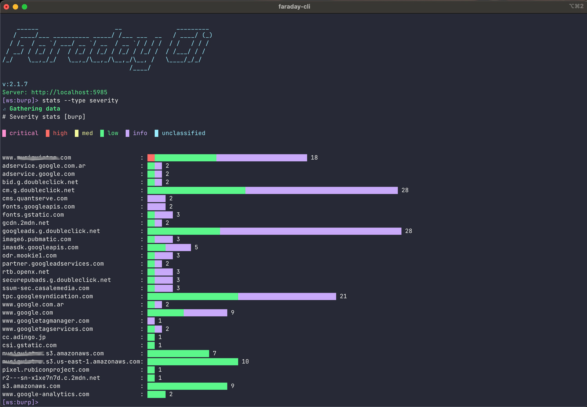

# Commands

All the commands can be run in ```Shell Mode``` or ```Command Mode```

## Authentication

### auth

Authenticate with your faraday server.

```
$ faraday-cli auth
Faraday url [http://localhost:5985]: http://localhost:5985
User: faraday
Password:
Saving config
✔ Authenticated with faraday: http://localhost:5985
```
*Optional arguments:*

| Syntax      | Description |
|:-----	|------:	|
| `-f/--faraday-url FARADAY_URL`       | url of your faraday server      |
| `-i/--ignore-ssl`   | Ignore SSL certificate validation        |
| `-i/--ignore-ssl`   | Ignore SSL certificate validation        |
| `-u/--user USER`  | Faraday user       |
| `-p/--password PASSWORD`  | Faraday password       |

!!! info "Faraday token expiration"
    You may want to change the faraday token expiration time, so you don't have to authenticate so often.

    The default is 12 hours.

    To do it change de value of ```api_token_expiration```(expressed in seconds) in your faraday ````server.ini````


### status

Show the status of your current authentication.

```
$ faraday-cli status
FARADAY SERVER         IGNORE SSL    VERSION    USER     VALID TOKEN    WORKSPACE
---------------------  ------------  ---------  -------  -------------  -----------
http://localhost:5985  False         corp-3.14  faraday  ✔              test
```
*Optional Arguments:*

| Syntax      | Description |
|:-----	|------:	|
| `-p/--pretty`   | Show table in a pretty format       |

## Workspaces

### workspace list

List workspaces created in faraday.

```
$ faraday-cli workspace list -p
+--------+---------+------------+---------+----------+----------+------------+
| NAME   |   HOSTS |   SERVICES | VULNS   | ACTIVE   | PUBLIC   | READONLY   |
|--------+---------+------------+---------+----------+----------+------------|
| test   |      13 |         13 | 39      | True     | False    | False      |
+--------+---------+------------+---------+----------+----------+------------+
```

*Optional Arguments:*

| Syntax      | Description |
|:-----	|------:	|
| `-j/--json-output`     | Show output in json     |
| `-p/--pretty`   | Show table in a pretty format       |
| `--show-inactive`   | Include inactive workspaces      |


### workspace delete

Delete workspace from faraday.

```
$ faraday-cli workspace delete test
Deleting workspace: test
Deleted workspace: test
```

*Required Arguments:*

| Syntax      | Description |
|:-----	|------:	|
| `WORKSPACE_NAME`     | Workspace name     |

### workspace get

Get details of a workspace.

```
$ faraday-cli workspace get -p test
+--------+----------+----------+------------+---------+------------+---------+
| NAME   | ACTIVE   | PUBLIC   | READONLY   |   HOSTS |   SERVICES |   VULNS |
|--------+----------+----------+------------+---------+------------+---------|
| test   | True     | False    | False      |      13 |         13 |      39 |
+--------+----------+----------+------------+---------+------------+---------+
```


*Required Arguments:*

| Syntax      | Description |
|:-----	|------:	|
| `WORKSPACE_NAME`      | Workspace name     |

*Optional Arguments:*

| Syntax      | Description |
|:-----	|------:	|
| `-j/--json-output`      | Show output in json     |
| `-p/--pretty`   | Show table in a pretty format       |

### workspace select

Select your active workspace, unless you use the ```-w``` argument all the commands will use this workspace.


```
$ faraday-cli workspace select test
✔ Selected workspace: test
```

*Required Arguments:*

| Syntax      | Description |
|:-----	|------:	|
| `WORKSPACE_NAME`      | Workspace name     |

### workspace create

Create a new workspace in faraday.


```
$ faraday-cli workspace create test_workspace
✔ Created workspace: test_workspace
```

*Required Arguments:*

| Syntax      | Description |
|:-----	|------:	|
| `WORKSPACE_NAME`      | Workspace name     |

*Optional Arguments:*

| Syntax      | Description |
|:-----	|------:	|
| `-d/--dont-select`      | Dont select after create     |

### workspace dashboard

Show a dashboard with different information about the workspaces.


```
$ faraday-cli workspace dashboard
+--------------+----------------------------+---------------+--------------+------------------------------------------------------------------------------------------------+
| WORKSPACE    | INFO                       | SUMMARY       | SEVERITIES   | ACTIVITY                                                                                       |
+==============+============================+===============+==============+================================================================================================+
| faraday_test | users: -                   | hosts: 56     | critical: 0  | Nmap (shell) found 1 hosts, 7 services and 0 vulns (0/0/0/0/0) 2 hours ago by faraday          |
|              | readonly: False            | services: 221 | high: 0      | Openvas (report) found 13 hosts, 13 services and 39 vulns (0/0/13/26/0) 2 hours ago by faraday |
|              | public: False              | vulns: 52     | med: 13      | agent_firstcan (agent) found 42 hosts, 201 services and 13 vulns (0/0/0/2/11) 3 days ago       |
|              | updated: 06/17/21 15:45:55 |               | low: 28      |                                                                                                |
|              |                            |               | info: 11     |                                                                                                |
+--------------+----------------------------+---------------+--------------+------------------------------------------------------------------------------------------------+
```


## Hosts

### host list

List hosts in a workspace.


```
$ faraday-cli host list -p
+------+------------+---------+-------------+------------+---------+
|   ID | IP         | OS      | HOSTNAMES   |   SERVICES |   VULNS |
|------+------------+---------+-------------+------------+---------|
|   11 | 127.0.0.1  | unknown |             |          1 |       3 |
|    3 | 127.0.0.10 | unknown |             |          1 |       3 |
|    6 | 127.0.0.11 | unknown |             |          1 |       3 |
|    5 | 127.0.0.12 | unknown |             |          1 |       3 |
|    7 | 127.0.0.13 | unknown |             |          1 |       3 |
|   13 | 127.0.0.2  | unknown |             |          1 |       3 |
|    2 | 127.0.0.3  | unknown |             |          1 |       3 |
|    9 | 127.0.0.4  | unknown |             |          1 |       3 |
|   10 | 127.0.0.5  | unknown |             |          1 |       3 |
|    4 | 127.0.0.6  | unknown |             |          1 |       3 |
|    8 | 127.0.0.7  | unknown |             |          1 |       3 |
|    1 | 127.0.0.8  | unknown |             |          1 |       3 |
|   12 | 127.0.0.9  | unknown |             |          1 |       3 |
+------+------------+---------+-------------+------------+---------+
```

*Optional Arguments:*

| Syntax      | Description |
|:-----	|------:	|
| `-w WORKSPACE_NAME`     | Workspace name    |
| `-p/--pretty`   | Show table in a pretty format       |
| `-j/--json-output`      | Show output in json     |
| `-ip/--list-ip`   | Show ip only      |
| `--port PORT`   | Listen in port      |

### host get

Get host information.


```
$ faraday-cli host get 13 -p
Host:
+------+-----------+---------+-------------+---------+---------+---------+
|   ID | IP        | OS      | HOSTNAMES   | OWNER   | OWNED   |   VULNS |
|------+-----------+---------+-------------+---------+---------+---------|
|   13 | 127.0.0.2 | unknown |             | faraday | False   |       3 |
+------+-----------+---------+-------------+---------+---------+---------+

Services:
+------+--------+---------------+------------+--------+-----------+----------+---------+
|   ID | NAME   | DESCRIPTION   | PROTOCOL   |   PORT | VERSION   | STATUS   |   VULNS |
|------+--------+---------------+------------+--------+-----------+----------+---------|
|   13 | ssh    |               | tcp        |     22 | unknown   | open     |       2 |
+------+--------+---------------+------------+--------+-----------+----------+---------+

Vulnerabilities:
+------+------------------------------------------+------------+----------+-------------+---------+
|   ID | NAME                                     | SEVERITY   | STATUS   | CONFIRMED   | TOOL    |
|------+------------------------------------------+------------+----------+-------------+---------|
|   37 | SSH Weak Encryption Algorithms Supported | MED        | opened   | False       | Openvas |
|   38 | SSH Weak MAC Algorithms Supported        | LOW        | opened   | False       | Openvas |
|   39 | TCP timestamps                           | LOW        | opened   | False       | Openvas |
+------+------------------------------------------+------------+----------+-------------+---------+
```

*Requirement Arguments:*

| Syntax      | Description |
|:-----	|------:	|
| `host_id`    | ID of the host    |

*Optional Arguments:*

| Syntax      | Description |
|:-----	|------:	|
| `-w WORKSPACE_NAME`     | Workspace name    |
| `-p/--pretty`   | Show table in a pretty format       |
| `-j/--json-output`      | Show output in json     |

### host delete

Delete host.


```
$ faraday-cli host delete 13
Host deleted
```

*Requirement Arguments:*

| Syntax      | Description |
|:-----	|------:	|
| `host_id`     | ID of the host    |

*Optional Arguments:*

| Syntax      | Description |
|:-----	|------:	|
| `-w WORKSPACE_NAME`     | Workspace name    |

### host create

Create hosts.


!!! info
    You can pass the host data via stdin.
    ```
    $ echo '[{"ip": "1.1.1.5", "description": "some text"}]' | faraday-cli host create --stdin
    ```

*Optional Arguments:*

| Syntax      | Description |
|:-----	|------:	|
| `-w WORKSPACE_NAME`     | Workspace name    |
| `-d/--host-data HOST_DATA`     | Host data in json format   |
| `--stdin`     | Read host-data from stdin   |

*host data schema*:
```
{'type': 'array', 'items': {'type': 'object', 'properties':
    {'ip': {'type': 'string'}, 'description': {'type': 'string'},
    'hostnames': {'type': 'array'}}, 'required': ['ip', 'description']}}
```

!!! warning
    If you pass the host data as an argument it needs to be escaped like this (only in command mode, not in shell mode).
    ```
    $ faraday-cli create hosts -d \''[{"ip": "stan.local", "description": "some server"}]'\'
    ```

## Services

### service list

List services in a workspace.


```
$ faraday-cli service list -p
+------+--------+--------------+------------+--------+------------+--------+---------+
|   ID | NAME   | SUMMARY      | IP         |   PORT | PROTOCOL   |   HOST |   VULNS |
|------+--------+--------------+------------+--------+------------+--------+---------|
|    1 | ssh    | (22/tcp) ssh | 127.0.0.8  |     22 | tcp        |      1 |       2 |
|    2 | ssh    | (22/tcp) ssh | 127.0.0.3  |     22 | tcp        |      2 |       2 |
|    3 | ssh    | (22/tcp) ssh | 127.0.0.10 |     22 | tcp        |      3 |       2 |
|    4 | ssh    | (22/tcp) ssh | 127.0.0.6  |     22 | tcp        |      4 |       2 |
|    5 | ssh    | (22/tcp) ssh | 127.0.0.12 |     22 | tcp        |      5 |       2 |
|    6 | ssh    | (22/tcp) ssh | 127.0.0.11 |     22 | tcp        |      6 |       2 |
|    7 | ssh    | (22/tcp) ssh | 127.0.0.13 |     22 | tcp        |      7 |       2 |
|    8 | ssh    | (22/tcp) ssh | 127.0.0.7  |     22 | tcp        |      8 |       2 |
|    9 | ssh    | (22/tcp) ssh | 127.0.0.4  |     22 | tcp        |      9 |       2 |
|   10 | ssh    | (22/tcp) ssh | 127.0.0.5  |     22 | tcp        |     10 |       2 |
|   11 | ssh    | (22/tcp) ssh | 127.0.0.1  |     22 | tcp        |     11 |       2 |
|   12 | ssh    | (22/tcp) ssh | 127.0.0.9  |     22 | tcp        |     12 |       2 |
+------+--------+--------------+------------+--------+------------+--------+---------+
```


*Optional Arguments:*

| Syntax      | Description |
|:-----	|------:	|
| `-w WORKSPACE_NAME`     | Workspace name    |
| `-p/--pretty`   | Show table in a pretty format       |
| `-j/--json-output`      | Show output in json     |

## Vulnerabilities

### vuln list

List vulnerabilities in a workspace.


```
$ faraday-cli vuln list -p
+------+-----------------------------------------------------------------------------+------------+----------+-------------+--------------------------------------------------+-------------+
|   ID | NAME                                                                        | SEVERITY   | STATUS   | CONFIRMED   | ASSET                                            | HOSTNAMES   |
|------+-----------------------------------------------------------------------------+------------+----------+-------------+--------------------------------------------------+-------------|
| 5200 | Terminal Services Encryption Level is Medium or Low                         | med        | opened   | False       | 10.33.112.22 [Service - (3389/tcp) msrdp]        | qa3app02    |
| 5198 | Microsoft Windows Remote Desktop Protocol Server Man-in-the-Middle Weakness | med        | opened   | False       | 10.33.112.22 [Service - (3389/tcp) msrdp]        | qa3app02    |
| 5120 | SMB Signing Disabled                                                        | med        | opened   | False       | 10.33.112.24 [Service - (445/tcp) cifs]          | qa3app04    |
| 5069 | Terminal Services Encryption Level is Medium or Low                         | med        | opened   | False       | 10.33.112.25 [Service - (3389/tcp) msrdp]        | qa3app05    |
| 5034 | Terminal Services Encryption Level is Medium or Low                         | med        | opened   | False       | 10.33.112.26 [Service - (3389/tcp) msrdp]        | qa3app06    |
| 5116 | Terminal Services Encryption Level is Medium or Low                         | med        | opened   | False       | 10.33.112.24 [Service - (3389/tcp) msrdp]        | qa3app04    |
| 5237 | Microsoft Windows Remote Desktop Protocol Server Man-in-the-Middle Weakness | med        | opened   | False       | 10.33.112.21 [Service - (3389/tcp) msrdp]        | qa3app01    |
| 5079 | SMB Signing Disabled                                                        | med        | opened   | False       | 10.33.112.25 [Service - (445/tcp) cifs]          | qa3app05    |
| 4997 | SMB Signing Disabled                                                        | med        | opened   | False       | 10.33.112.29 [Service - (445/tcp) cifs]          | qa3app09    |
| 5151 | Terminal Services Encryption Level is Medium or Low                         | med        | opened   | False       | 10.33.112.23 [Service - (3389/tcp) msrdp]        | qa3app03    |
| 5239 | Terminal Services Encryption Level is Medium or Low                         | med        | opened   | False       | 10.33.112.21 [Service - (3389/tcp) msrdp]        | qa3app01    |
| 5161 | SMB Signing Disabled                                                        | med        | opened   | False       | 10.33.112.23 [Service - (445/tcp) cifs]          | qa3app03    |
| 5235 | Terminal Services Doesn't Use Network Level Authentication (NLA)            | med        | opened   | False       | 10.33.112.21 [Service - (3389/tcp) msrdp]        | qa3app01    |
| 5249 | SMB Signing Disabled                                                        | med        | opened   | False       | 10.33.112.21 [Service - (445/tcp) cifs]          | qa3app01    |
| 4983 | Terminal Services Doesn't Use Network Level Authentication (NLA)            | med        | opened   | False       | 10.33.112.29 [Service - (3389/tcp) msrdp]        | qa3app09    |
| 5067 | Microsoft Windows Remote Desktop Protocol Server Man-in-the-Middle Weakness | med        | opened   | False       | 10.33.112.25 [Service - (3389/tcp) msrdp]        | qa3app05    |
| 5038 | SMB Signing Disabled                                                        | med        | opened   | False       | 10.33.112.26 [Service - (445/tcp) cifs]          | qa3app06    |
| 4987 | Terminal Services Encryption Level is Medium or Low                         | med        | opened   | False       | 10.33.112.29 [Service - (3389/tcp) msrdp]        | qa3app09    |
| 5272 | Ethernet Card Manufacturer Detection                                        | info       | opened   | False       | 10.33.112.21 [Host - ID:72]                      | qa3app01    |
| 5142 | OS Identification                                                           | info       | opened   | False       | 10.33.112.24 [Host - ID:69]                      | qa3app04    |
| 5228 | OS Identification                                                           | info       | opened   | False       | 10.33.112.22 [Host - ID:71]                      | qa3app02    |
+------+-----------------------------------------------------------------------------+------------+----------+-------------+--------------------------------------------------+-------------+
```


*Optional Arguments:*

| Syntax              | Description |
|:--------------------|------:	|
| `-w WORKSPACE_NAME` | Workspace name    |
| `-p/--pretty`       | Show table in a pretty format       |
| `-j/--json-output`  | Show output in json     |
| `--severity [SEVERITY [SEVERITY ...]]`      | Filter by severity informational/critical/high/medium/low/unclassified     |
| `--confirmed`   | Confirmed vulnerabilities       |


### vuln add-evidence

Add an image evidence to a vulnerability

```
$ faraday-cli vuln add-evidence -id 46 -w test ~/evidence.png
Evidence upload was successful
```

*Required Arguments:*

| Syntax      | Description |
|:-----	|------:	|
| `-id/--vulnerability-id`   | Vulnerability ID       |
| `image`      | Image path     |


*Optional Arguments:*

| Syntax      | Description |
|:-----	|------:	|
| `-w WORKSPACE_NAME`     | Workspace name    |

### vuln update

Update one or more fields of a vulnerability

```
$ faraday-cli vuln update 46 -w test --status closed
Vulnerability updated
```

*Required Arguments:*

| Syntax      | Description |
|:-----	|------:	|
| `-id/--vulnerability-id`   | Vulnerability ID       |

*Optional Arguments:*

| Syntax                  |                                                                                       Description |
|:------------------------|--------------------------------------------------------------------------------------------------:|
| `-w WORKSPACE_NAME`     |                                                                                    Workspace name |
| `--status STATUS`       |                               Status of the Vulnerability: open, closed, re-opened, risk-accepted |
| `--severity SEVERITY`   |                       Severity of the Vulnerability: unclassified, info, low, med, high, critical |
| `--desc DESCRIPTION`    |                                                                                       Description |
| `--name NAME`           |                                                                                Vulnerability Name |
| `--tag TAG`             | Tag to add to the vuln. In case that you want add more than one vuln you can repeat this argument |
| `--confirmed CONFIRMED` |                                          Indicates if the Vulnerability is confirmed: True, False |


## Tools and Reports

### tool report

Process different tools reports and upload the information into faraday.

!!! info
    Check our [Faraday Plugins](https://github.com/infobyte/faraday_plugins) repo for information about compatible tools.


```
$ faraday-cli tool report $HOME/Downloads/openvas-report.xml
📄 Processing Openvas report
⬆ Sending data to workspace: test
✔ Done
```

*Required Arguments:*

| Syntax      | Description |
|:-----	|------:	|
| `report_path`     | Path of the report file    |

*Optional Arguments:*

| Syntax                   | Description |
|:-------------------------|------:	|
| `-w WORKSPACE_NAME`      | Workspace name    |
| `--create-workspace`     | if -w is used and the workspace dont exists, it will create it    |
| `--plugin-id PLUGIN_ID`  | Plugin ID (force detection)       |
| `-j/--json-output`       | Show output in json (dont send it to faraday)       |
| `--vuln-tag VULN_TAG`    | Tag to add to vulnerabilities       |
| `--host-tag HOST_TAG`    | Tag to add to hosts       |
| `--service-tag SERVICE_TAG` | Tag to add to services      |

### tool run

Execute a tool and upload the information into faraday.

!!! info
    Check our [Faraday Plugins](https://github.com/infobyte/faraday_plugins) repo for information about compatible tools.


```
$ faraday-cli tool run \"nmap www.exampledomain.com\"
💻 Processing Nmap command
Starting Nmap 7.80 ( https://nmap.org ) at 2021-02-22 14:13 -03
Nmap scan report for www.exampledomain.com (10.196.205.130)
Host is up (0.17s latency).
rDNS record for 10.196.205.130: 10.196.205.130.bc.googleusercontent.com
Not shown: 996 filtered ports
PORT     STATE  SERVICE
80/tcp   open   http
443/tcp  open   https
2222/tcp open   EtherNetIP-1
3306/tcp closed mysql

Nmap done: 1 IP address (1 host up) scanned in 11.12 seconds
⬆ Sending data to workspace: test
✔ Done
```

*Required Arguments:*

| Syntax      | Description |
|:-----	|------:	|
| `command`     | Command of the tool to process    |

*Optional Arguments:*

| Syntax      | Description |
|:-----	|------:	|
| `-w WORKSPACE_NAME`     | Workspace name    |
| `--plugin-id PLUGIN_ID`   | Plugin ID (force detection)       |
| `-j/--json-output`   | Show output in json (dont send it to faraday)       |
| `--vuln-tag VULN_TAG`    | Tag to add to vulnerabilities       |
| `--host-tag HOST_TAG`    | Tag to add to hosts       |
| `--service-tag SERVICE_TAG` | Tag to add to services      |

## Vulnerabilities Stats

### stats

Different stats about the vulnerabilities in Faraday.




*Required Arguments:*

| Syntax                         | Description |
|:-------------------------------|------:	|
| `--type {severity,vulns,date}` | Type of stat    |

*Optional Arguments:*

| Syntax      | Description |
|:-----	|------:	|
| `-w WORKSPACE_NAME`     | Workspace name    |
| `--create-workspace`     | if -w is used and the workspace dont exists, it will create it    |
| `--ignore-info`   | Ignore informational/unclassified vulnerabilities       |
| `--severity [SEVERITY [SEVERITY ...]]`      | Filter by severity informational/critical/high/medium/low/unclassified     |
| `--confirmed`   | Confirmed vulnerabilities       |


## Agents


!!! info
    For these commands you need to have our [Faraday Agents](https://github.com/infobyte/faraday_agent_dispatcher) configured.

### agent list

List all configured agents.


```
$ faraday-cli agent list
  ID  NAME    ACTIVE    STATUS    EXECUTORS
----  ------  --------  --------  -----------
   2  nico    True      online    nmap
```


*Optional Arguments:*

| Syntax      | Description |
|:-----	|------:	|
| `-p/--pretty`   | Show table in a pretty format       |
| `-j/--json-output`      | Show output in json     |

### agent get

Get information of and agent and its executors.


```
$ faraday-cli agent get 2
   ID  NAME    ACTIVE    STATUS
----  ------  --------  --------
   2  nico    True      online

Executors:
  ID  NAME    PARAMETERS [REQUIRED]
----  ------  -----------------------
   2  nmap    target [True]
              option_pn [False]
              option_sc [False]
              option_sv [False]
              port_list [False]
              top_ports [False]
              host_timeout [False]
              script_timeout [False]
```

*Required Arguments:*

| Syntax      | Description |
|:-----	|------:	|
| `AGENT_ID`     | ID of the Agent    |

*Optional Arguments:*

| Syntax      | Description |
|:-----	|------:	|
| `-p/--pretty`   | Show table in a pretty format       |
| `-j/--json-output`      | Show output in json     |

### agent run

Run an executor.


!!! info
    You can pass the executor parameters via stdin.
    ```
    $ echo '{"target": "www.google.com"}' | faraday-cli agent run -a 1 -e nmap --stdin --workspace-name my_workspace
    ```
    If no ```-p``` or ```--stdin``` argument is provided, then the executor parameters will be asked one by one.

    You can store the parameters in env variables and will be auto loaded.

    Example:
    ```
    For the TARGET parameter of the NMAP executor save the variable FARADAY_CLI_EXECUTOR_NMAP_TARGET
    ```

    You can store the parameters in a file and use it as a 'profile' to repeat scans
    ```
    $ cat scan_test.com_nmap.vars
    FARADAY_CLI_EXECUTOR_NMAP_TARGET=test.com
    FARADAY_CLI_EXECUTOR_NMAP_OPTION_PN=true
    FARADAY_CLI_EXECUTOR_NMAP_OPTION_SC=false
    FARADAY_CLI_EXECUTOR_NMAP_OPTION_SV=true
    FARADAY_CLI_EXECUTOR_NMAP_PORT_LIST=
    FARADAY_CLI_EXECUTOR_NMAP_TOP_PORTS=
    FARADAY_CLI_EXECUTOR_NMAP_HOST_TIMEOUT=
    FARADAY_CLI_EXECUTOR_NMAP_SCRIPT_TIMEOUT=

    $ source scan_test.com_nmap.vars && faraday-cli agent run -a 2 -e nmap -w test
    Running executor: unnamed_agent/nmap
    Parameters: {"TARGET": "test.com", "OPTION_PN": "true", "OPTION_SC": "false", "OPTION_SV": "true"}
    Generated Command: 14
    ```

!!! warning
    If you pass the executor parameters as an argument it needs to be escaped like this (only in command mode, not in shell mode).
    ```
    $ faraday-cli  agent run -a 1 -e nmap -p \''{"target": "www.go ogle.com"}'\'
    Running executor: unnamed_agent/nmap
    Parameters: {"TARGET": "www.google.com"}
    Generated Command: 13
    ```

*Required Arguments:*

| Syntax                                 | Description |
|:---------------------------------------|------:	|
| `-a/--agent-id AGENT_ID`               | ID of the agent    |
| `-e/--executor-name EXECUTOR_NAME`     | Executor name   |
| `-p/--executor-params EXECUTOR_PARAMS` | Executor Params in json  |
| `-w --workpsace-name`                  | Workspace name    |

*Optional Arguments:*

| Syntax      | Description |
|:-----	|------:	|
| `--stdin`   | Read executor-params from stdin       |


## Executive Reports

!!! info
    These commands only work with a commercial version of [Faraday](https://www.faradaysec.com).

### executive_report list-templates

List the templates available to generate Executive Reports.


```
$ faraday-cli executive_report list-templates -p
+------------------------------------------------------------------+-----------+
| NAME                                                             | GROUPED   |
|------------------------------------------------------------------+-----------|
| generic_default.docx (generic) (Word)                            | False     |
| generic_default.html (generic) (PDF)                             | False     |
| group_default.docx (grouped) (Word)                              | True      |
| group_default.html (grouped) (PDF)                               | True      |
+------------------------------------------------------------------+-----------+
```


*Optional Arguments:*

| Syntax      | Description |
|:-----	|------:	|
| `-w WORKSPACE_NAME`     | Workspace name    |
| `-p/--pretty`   | Show table in a pretty format       |

### executive_report create

Generate an executive report with a given template.

```
$ faraday-cli executive_report create -t \'"generic_default.html (generic) (PDF)"\'  --title title --summary summary --enterprise company  -d /tmp/test.pdf  --ignore-info
Report created: /tmp/test.pdf
```

*Optional Arguments:*

| Syntax      | Description |
|:-----	|------:	|
| `-w WORKSPACE_NAME`     | Workspace name    |
| `-t/--template TEMPLATE`   | Template       |
| `--title TITLE`   | Report title       |
| `--summary SUMMARY`   | Report summary      |
| `--recommendations RECOMMENDATIONS`   | Report recommendations      |
| `--conclusions CONCLUSIONS`   | Report conclusions      |
| `--scope SCOPE`   | Report scope      |
| `--objectives OBJECTIVES`   | Report objectives      |
| `--enterprise ENTERPRISE`   | Enterprise name      |
| `--confirmed`   | Confirmed vulnerabilities      |
| `--severity [SEVERITY [SEVERITY ...]]`   | Filter by severity informational/critical/high/medium/low/unclassified      |
| `--ignore-info`   | Ignore informational/unclassified vulnerabilities     |
| `-d/--destination DESTINATION`   | Report destination      |


## help

Using the help command you can get info of any command.
```
$ faraday-cli help -v

Documented commands (use 'help -v' for verbose/'help <topic>' for details):

Core
--------------------------------------------------------------------------------
auth                Authenticate with a faraday server
exit                exit the application. Shorthand: Ctrl-D.
status              Show Cli status
version             Faraday cli version

Objects
--------------------------------------------------------------------------------
agent               agent actions
executive_report    executive_report actions
host                host actions
service             service actions
tool                tool actions
vuln                vulnerabilities actions
workspace           workspace actions
...
```

```
$  faraday-cli help auth
usage: auth [-h] [-f FARADAY_URL] [-i] [-u USER] [-p PASSWORD]

Authenticate with a faraday server

optional arguments:
  -h, --help            show this help message and exit
  -f FARADAY_URL, --faraday-url FARADAY_URL
                        Faraday server URL
  -i, --ignore-ssl      Ignore SSL verification
  -u USER, --user USER  Faraday user
  -p PASSWORD, --password PASSWORD
                        Faraday password
```
